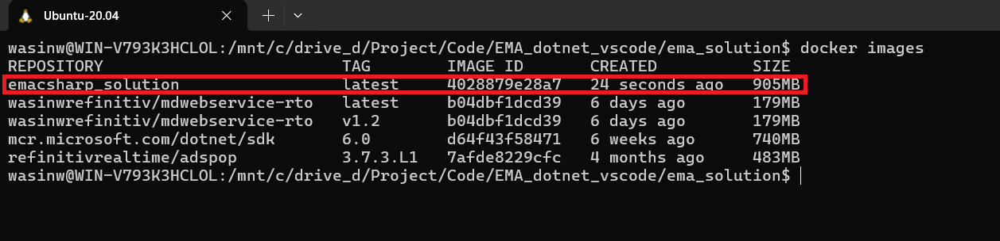

# How to Containerize EMA C# Project and Solution

## <a id="intro"></a>Introduction

[Real-Time SDK (C# Edition)](https://developers.lseg.com/en/api-catalog/refinitiv-real-time-opnsrc/refinitiv-real-time-csharp-sdk) (RTSDK, formerly known as Elektron SDK) is a suite of modern and open source APIs ([GitHub](https://github.com/Refinitiv/Real-Time-SDK)) that aim to simplify development through a strong focus on ease of use and standardized access to LSEG Real-Time Platform via the proprietary TCP connection named RSSL and proprietary binary message encoding format named OMM Message. The capabilities range from low latency/high-performance APIs right through to simple streaming Web APIs.

The RTSDK C# Edition can run on Windows, Oracle Linux Server, Red Hat Enterprise Server and Ubuntu Linux platforms. It supports the [Visual Studio 2022 IDE](https://visualstudio.microsoft.com/vs/) for the full features development experience but the IDE is available for Windows developers only. Fortunately, the RTSDK C# Edition also supports the cross-platform [.NET SDK 6](https://learn.microsoft.com/en-us/dotnet/core/whats-new/dotnet-6) (aka .NET Core 6) framework and the [Visual Studio Code](https://code.visualstudio.com/) (aka VS Code) editor is available for all major OS platforms. Linux and Windows developers who are using the VS Code editor can implement the real-time streaming application with LSEG Real-Time platform using the RTSDK C# Edition.

This document explains how to containerize the EMA C# Project and Solution. I am using [Docker](https://www.docker.com/) as a main container orchestration tool in this document.

**Note**: Please note that the Real-Time SDK isn't qualified on the Docker platform. If you find any problems while running it on the Docker platform, the issues must be replicated on bare metal machines before contacting the helpdesk/Real-Time APIs support.

## What is a Container?

According to [Docker](https://www.docker.com/resources/what-container/) and [Azure](https://azure.microsoft.com/en-in/resources/cloud-computing-dictionary/what-is-a-container), and [GCP](https://cloud.google.com/learn/what-are-containers) documents, a container is a standard unit of software that packages up code and all its dependencies and configurations files required for the app to run. The application's container can runs quickly and reliably from one computing environment to another. Multiple containers can run on the same machine and share the OS kernel with other containers, each running as isolated processes in user space. The containerized application can be tested as a unit and deployed as a container image instance to the host operating system.


Image from [Azure website](https://azure.microsoft.com/en-in/resources/cloud-computing-dictionary/what-is-a-container).

Container Benefits:

- Enable developers and IT professionals to deploy applications across environments with little or no modification.
- Containers take up less space than Virtual Machines.
- Streamline the whole dev and test cycle by shipping the application as container which is easy for deployment.
- Increases collaboration and efficiency between dev and operations teams to ship apps faster.
- Portability between OS platforms and between clouds.
- Container is lightweight, so many containers can be supported on the same infrastructure.
- Easy for rapid scale-up and scale-down scenarios.

## <a id="prerequisite"></a>Prerequisite

Before I am going further, there is some prerequisite, dependencies, and libraries that the project is needed.

### The Main Project Prerequisite

This Docker project requires all prerequisite mentioned in the [Prerequisite section of the README.md](./README.md) document.

### Docker Desktop Application

The [Docker Desktop](https://www.docker.com/products/docker-desktop/) application is required to run this Docker project.

That covers the prerequisite of this project.

## Updating EMA Solution Source Code

The EMAConsumer project inside the ```ema_solution``` has been updated to receive the following information via a command line argument:

- ```-clientId```: Authentication Version 2 CLIENT_ID information.
- ```-clientSecret```: Authentication Version 2 CLIENT_SECRET information.
- ```-itemName```: The RIC name you want to subscribe to.

Please see the [Program.cs](./ema_solution/EMAConsumer/Program.cs) for more detail about the changed.

**Note**: You can also set the *CLIENT_ID* and *CLIENT_SECRET* information via the Environment variables or a ```.env``` file too.

## Containerize EMA C# Project and Solution

The [.NET Docker Images](https://github.com/dotnet/dotnet-docker) are hosted on the [Microsoft Container Registry repository](https://mcr.microsoft.com/en-us/). We can use a [Docker desktop application](https://www.docker.com/products/docker-desktop/) to pull .NET Docker Images directly.

### Docker ignore file

Before I am going further, let's start by creating a ```.dockerignore``` file inside a ```ema_solution``` folder to define the files/folders that we do not want Docker to build or copy to an image. Those files and folders are the compiled files/folders in our environment and a ```.env``` file.

```ini
EMAConsumer/bin/
EMAConsumer/obj/
EMAConsumer/.env
EMAConsumer/.env.example
JSONUtil/bin/
JSONUtil/obj/
global.json
```

**Note**: A ```global.json``` file is for defining .NET SDK version in a local environment only. We are going to use .NET Docker Images to build the project, so that file is not need for a Docker image.

### Let's build our first image

The easiest way is to copy our project/solution source code to a container and use [.NET SDK images](https://hub.docker.com/_/microsoft-dotnet-sdk/) to build and run the application. I am demonstrating with the ```ema_solution``` project with the ```mcr.microsoft.com/dotnet/sdk:6.0``` .NET 6 Docker image. A ```Dockerfile``` (inside a ```ema_solution``` folder) is as follows:

```dockerfile
FROM mcr.microsoft.com/dotnet/sdk:6.0
LABEL maintainer="Developer Relations"

# Create app directory
WORKDIR /App

# Copy everything
COPY . ./
# Restore as distinct layers
RUN dotnet restore
# Build and publish a release
RUN dotnet build 
RUN dotnet publish --configuration Release -o out
#Copy EmaConfig.xml
COPY EMAConsumer/EmaConfig.xml .
#Run the application
ENTRYPOINT ["dotnet","/App/out/EMAConsumer.dll"]
```

Then build a docker image from with the following [docker build](https://docs.docker.com/reference/cli/docker/image/build/) command:

```bash
docker build . -t emacsharp_solution
```

Once a build process is successful, you can use a [docker images](https://docs.docker.com/reference/cli/docker/image/ls/) command to check our newly created Docker image.



We can run a EMA C# project container via a [docker run](https://docs.docker.com/reference/cli/docker/container/run/) command as follows (you should have a ```.env``` file that have your Authentication Version 2 define in it):

```bash
docker run -it --name emacsharp_solution --env-file EMAConsumer/.env emacsharp_solution -itemName THB=
```

Result:


However, our images isn't optimized yet. The image size is also 905mb which is very huge. It is ideally to share smaller images among the teams.

### Optimize Dotnet Restore

By default, each instruction in a Dockerfile translates to a layer in your final image in an order specified. If Docker finds that you have already executed a similar instruction before, Docker skips that layer and uses the cached result instead. However, if there is a layer that have been changed (updated code, add new instruction, etc.), that layer will need to be re-built. And if a layer is changed, all other layers that come after it are also affected and need to re-built too.

This is called a *Docker build cache*. One main target of a Dockerfile optimization is structuring a Dockerfile to reuse results from previous builds and skipping unnecessary work as much as possible.

You can find more detail about a Docker build cache behavior from the following resources:

- [Docker build cache document](https://docs.docker.com/build/cache/)
- [Using the build cache document](https://docs.docker.com/guides/docker-concepts/building-images/using-the-build-cache/)

For .NET application, it is advisable to copy only the **.csproj**, **.sln**, and **nuget.config** files for your application before performing a [dotnet restore](https://learn.microsoft.com/en-us/dotnet/core/tools/dotnet-restore) command. By copying those files first, Docker can cache the project dependencies restoration result, and the dependencies restoration process will not be effected by just a code changed.

```dockerfile
FROM mcr.microsoft.com/dotnet/sdk:6.0
LABEL maintainer="Developer Relations"

# Create app directory
WORKDIR /App

# Copy project files
COPY ema_solution.sln ./
COPY EMAConsumer/EMAConsumer.csproj /App/EMAConsumer/EMAConsumer.csproj
COPY JSONUtil/JSONUtil.csproj /App/JSONUtil/JSONUtil.csproj
# Restore as distinct layers
RUN dotnet restore
# Copy everything else
COPY . ./
# Build and publish a release
RUN dotnet publish --configuration Release -o out

#Copy EmaConfig.xml
COPY EMAConsumer/EmaConfig.xml .
#Run the application
ENTRYPOINT ["dotnet","/App/out/EMAConsumer.dll"]
```

Now, we have optimized our Dockerfile to copy the solution *.sln* and *.csproj* files and run a *dotnet restore* command before copy the source code. However, if you run a *docker images* command you will be noticed that the image size does not change. How can we reduce our image size?

### Multi-Stage Builds

[Docker Multi-stage builds](https://docs.docker.com/build/building/multi-stage/) is a technique for optimizing a Dockerfile with multiple ```FROM``` statements. Each ```FROM``` instruction can use a different image base,and each of them begins a new stage of the build. You can selectively copy artifacts from one stage to another, leaving behind everything you don't want in the final image.

The easiest multi-stage builds is to use two ```FROM``` instructions, one is the *full SDK image* for build the application, and another one is the *runtime image* for running the application only. This technique help optimizes a Dockerfile to be in ordered, easy to read and maintain, and also reduce the final image size dramatically.

Microsoft offers various types of images for developers. The [.NET SDK images](https://hub.docker.com/_/microsoft-dotnet-sdk/) is suitable for developing, building, and testing .NET applications, the [.NET Runtime images](https://hub.docker.com/_/microsoft-dotnet-runtime/) is optimizing for running .NET applications in production.

If you recheck a Tags section of the [.NET Runtime images](https://hub.docker.com/_/microsoft-dotnet-runtime/) page, you will be noticed that the .NET Runtime container images have several variants including the *focal* variant which is based on the RTSDK supported [Ubuntu 20.04](https://releases.ubuntu.com/focal/) platform. I am using the *mcr.microsoft.com/dotnet/sdk:6.0* and *mcr.microsoft.com/dotnet/runtime:6.0-focal* images in our multi-stage Dockerfile.

```Dockerfile
ARG DOTNET_VERSION=6.0
ARG VARIANT=focal
FROM mcr.microsoft.com/dotnet/sdk:${DOTNET_VERSION} AS builder
LABEL maintainer="Developer Relations"

# Create app directory
WORKDIR /App

# Copy project files
COPY ema_solution.sln ./
COPY EMAConsumer/EMAConsumer.csproj /App/EMAConsumer/EMAConsumer.csproj
COPY JSONUtil/JSONUtil.csproj /App/JSONUtil/JSONUtil.csproj
# Restore as distinct layers
RUN dotnet restore ema_solution.sln
# Copy everything else
COPY . ./
# Build and publish a release
RUN dotnet publish ema_solution.sln --configuration Release -o out 


# Build runtime image
FROM mcr.microsoft.com/dotnet/runtime:${DOTNET_VERSION}-${VARIANT} as release
# Create app directory
WORKDIR /App
COPY --from=builder /App/out .
COPY EMAConsumer/EmaConfig.xml .
ENTRYPOINT ["dotnet","EMAConsumer.dll"]
```

Please be noticed that I am using a [Dockerfile ARG instruction](https://docs.docker.com/reference/dockerfile/#arg) to define .NET version and variant variables for easy version and variant updates. You can change these variables in a Dockerfile or via ```docker build``` command using the ```--build-arg <varname>=<value>``` flag.

Based on a ```Dockerfile``` above, the first ```FROM``` instruction uses the *mcr.microsoft.com/dotnet/sdk:6.0* SDK image as a *builder stage*. The builder stage's instructions is just copy the project files and build an application binary.

The second ```FROM``` instruction uses the *mcr.microsoft.com/dotnet/runtime:6.0-focal* image as a *release stage*. The instructions are just copy the built result from the *build stage* and the EmaConfig.xml file to the final image.

The final image contains only runtime, libraries, and necessary file to run the application. When you rebuild a Docker image with ```docker build . -t emacsharp_solution``` command, the final image size is reduced to 193mb as follows.


#### Caution

You may be noticed that I am not using the [Alpine variant image](https://www.docker.com/blog/how-to-use-the-alpine-docker-official-image/) which gives you a smaller footprint Docker image on this project. The reason is the [Alpine Linux](https://alpinelinux.org/) is not been tested and qualified with RTSDK.

## Next Steps

This project shows how to build EMA C# Docker image and run it's container locally. There are more things to do such as [run a unit test with your Docker](https://docs.docker.com/language/dotnet/run-tests/), or share a container with a Docker Registry Repository (self hosted or 3rd Party service), etc.

The next reasonable step is to integrate your application image with the continuous integration and continuous delivery (CI/CD) system to complete the develop-build-test-deploy automation pipeline. You can find more detail about how to configure CI/CD for your development project from the following resources:

- [Configure CI/CD for your .NET application](https://docs.docker.com/language/dotnet/configure-ci-cd/)
- [Introduction to GitHub Actions](https://docs.docker.com/build/ci/github-actions/)
- [How to build a CI/CD pipeline with Docker and CirCle CI](https://docs.docker.com/build/ci/)
- [GitLab Docker executor](https://docs.gitlab.com/runner/executors/docker.html)
- [GitHub Actions](https://docs.github.com/en/actions)

## Reference

For further details, please check out the following resources:

- [Docker: Containerize a .NET application](https://docs.docker.com/language/dotnet/containerize/)
- [Microsoft Learn: Tutorial - Containerize a .NET app](https://learn.microsoft.com/en-us/dotnet/core/docker/build-container?tabs=windows&pivots=dotnet-8-0)
- [Docker Blog: 9 Tips for Containerizing Your .NET Application](https://www.docker.com/blog/9-tips-for-containerizing-your-net-application/)
- [Microsoft .NET SDK Images](https://hub.docker.com/_/microsoft-dotnet-sdk) website.
- [Microsoft .NET Runtime Images](https://hub.docker.com/_/microsoft-dotnet-runtime/) website.
- [Dockerfile reference](https://docs.docker.com/reference/dockerfile/)
- [Docker build reference](https://docs.docker.com/reference/cli/docker/image/build/)
- [Docker run reference](https://docs.docker.com/reference/cli/docker/container/run/)
- [Docker build cache document](https://docs.docker.com/build/cache/)
- [Using the build cache document](https://docs.docker.com/guides/docker-concepts/building-images/using-the-build-cache/)
- [Docker Multi-stage builds](https://docs.docker.com/build/building/multi-stage/)
