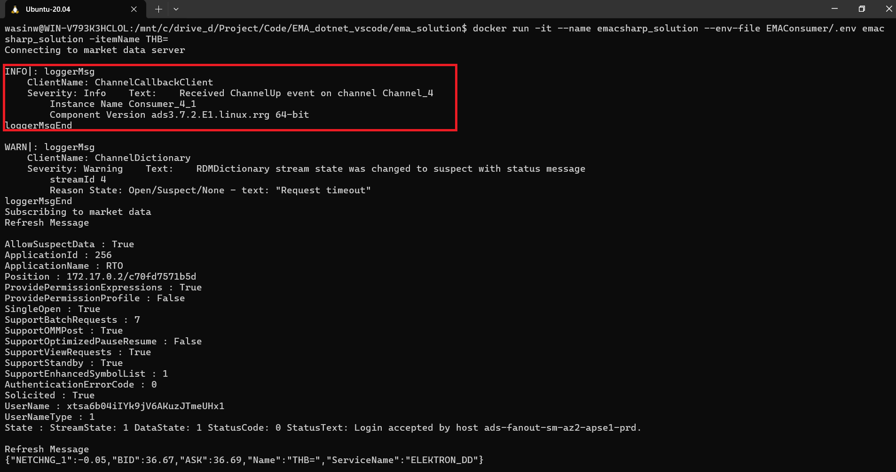

# How to Containerize EMA C# Project and Solution

## <a id="intro"></a>Introduction

[Real-Time SDK (C# Edition)](https://developers.lseg.com/en/api-catalog/refinitiv-real-time-opnsrc/refinitiv-real-time-csharp-sdk) (RTSDK, formerly known as Elektron SDK) is a suite of modern and open source APIs ([GitHub](https://github.com/Refinitiv/Real-Time-SDK)) that aim to simplify development through a strong focus on ease of use and standardized access to LSEG Real-Time Platform via the proprietary TCP connection named RSSL and proprietary binary message encoding format named OMM Message. The capabilities range from low latency/high-performance APIs right through to simple streaming Web APIs.

The RTSDK C# Edition can run on Windows, Oracle Linux Server, Red Hat Enterprise Server and Ubuntu Linux platforms. It supports the [Visual Studio 2022 IDE](https://visualstudio.microsoft.com/vs/) for the full features development experience but the IDE is available for Windows developers only. Fortunately, the RTSDK C# Edition also supports the cross-platform [.NET SDK 6](https://learn.microsoft.com/en-us/dotnet/core/whats-new/dotnet-6) (aka .NET Core 6) framework and the [Visual Studio Code](https://code.visualstudio.com/) (aka VS Code) editor is available for all major OS platforms. Linux and Windows developers who are using the VS Code editor can implement the real-time streaming application with LSEG Real-Time platform using the RTSDK C# Edition.

This document explains how to containerize the EMA C# Project and Solution. I am using [Docker](https://www.docker.com/) as a main container orchestration tool in this document.

**Note**: Please note that the Real-Time SDK isn't qualified on the Docker platform. If you find any problems while running it on the Docker platform, the issues must be replicated on bare metal machines before contacting the helpdesk/Real-Time APIs support.

## What is a Container?

According to [Docker](https://www.docker.com/resources/what-container/) and [Azure](https://azure.microsoft.com/en-in/resources/cloud-computing-dictionary/what-is-a-container), and [GCP](https://cloud.google.com/learn/what-are-containers) documents, a container is a standard unit of software that packages up code and all its dependencies and configurations files required for the app to run. The application's container can runs quickly and reliably from one computing environment to another. Multiple containers can run on the same machine and share the OS kernel with other containers, each running as isolated processes in user space. The containerized application can be tested as a unit and deployed as a container image instance to the host operating system.


Container Benefits:

- Enable developers and IT professionals to deploy applications across environments with little or no modification.
- Containers take up less space than Virtual Machines.
- Streamline the whole dev and test cycle by shipping the application as container which is easy for deployment.
- Increases collaboration and efficiency between dev and operations teams to ship apps faster.
- Portability between OS platforms and between clouds.
- Container is lightweight, so many containers can be supported on the same infrastructure. 
- Easy for rapid scale-up and scale-down scenarios.

## Containerize EMA C# Project and Solution

The [.NET Docker Images](https://github.com/dotnet/dotnet-docker) are hosted on the [Microsoft Container Registry repository](https://mcr.microsoft.com/en-us/). We can use a [Docker desktop application](https://www.docker.com/products/docker-desktop/) to pull .NET Docker Images directly.

### Docker ignore file

Before I am going further, let's start by creating a ```.dockerignore``` file inside a ```ema_project``` folder to define the files/folders that we do not want Docker to build or copy to an image. Those files and folders are the compiled files/folders in our environment and a ```.env``` file.

```ini
bin/
obj/
.env
global.json
```

**Note**: A ```global.json``` file is for defining .NET SDK version in a local environment only. We are going to use .NET Docker Images to build the project, so that file is not need for a Docker image.

### Let's build our first image

The easiest way is to copy our project/solution source code to a container and use [.NET SDK images](https://hub.docker.com/_/microsoft-dotnet-sdk/) to build and run the application. I am demonstrating with the ```ema_project``` project with the ```mcr.microsoft.com/dotnet/sdk:6.0``` .NET 6 Docker image. A ```Dockerfile``` (inside a ```ema_project``` folder) is as follows:

```dockerfile
FROM mcr.microsoft.com/dotnet/sdk:6.0

# Create app directory
WORKDIR /App

# Copy everything
COPY . ./
# Restore as distinct layers
RUN dotnet restore
# Build and publish a release
RUN dotnet publish --configuration Release -o out
#Run the application
ENTRYPOINT ["dotnet","/App/out/ema_project.dll"]
```

Then build a docker image from with the following [docker build](https://docs.docker.com/reference/cli/docker/image/build/) command:

```bash
docker build . -t emacsharp_project
```

Once a build process is successful, you can use a [docker images](https://docs.docker.com/reference/cli/docker/image/ls/) command to check our newly created Docker image.


We can run a EMA C# project container via a [docker run](https://docs.docker.com/reference/cli/docker/container/run/) command as follows (you should have a ```.env``` file that have your Authentication Version 2 define in it):

```bash
docker run -it --name emacsharp_project --env-file .env emacsharp_project
```

Result:



However, our images isn't optimized yet. The image size is 893mb which is very huge. It is ideally to share smaller images among the teams.

## Reference

- [Docker: Containerize a .NET application](https://docs.docker.com/language/dotnet/containerize/)
- [Microsoft Learn: Tutorial - Containerize a .NET app](https://learn.microsoft.com/en-us/dotnet/core/docker/build-container?tabs=windows&pivots=dotnet-8-0)
- [Docker Blog: 9 Tips for Containerizing Your .NET Application](https://www.docker.com/blog/9-tips-for-containerizing-your-net-application/)
- 
