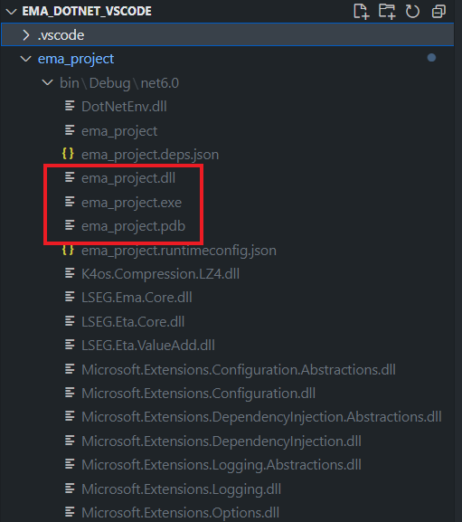

# Step By Step Guide EMA C# project with VS Code 
- version: 1.0.0
- Last Update: January 2024
- Environment: Ubuntu or Windows
- Compiler: .NET 6.0
- Prerequisite: [prerequisite](#prerequisite)

Example Code Disclaimer:
ALL EXAMPLE CODE IS PROVIDED ON AN “AS IS” AND “AS AVAILABLE” BASIS FOR ILLUSTRATIVE PURPOSES ONLY. REFINITIV MAKES NO REPRESENTATIONS OR WARRANTIES OF ANY KIND, EXPRESS OR IMPLIED, AS TO THE OPERATION OF THE EXAMPLE CODE, OR THE INFORMATION, CONTENT, OR MATERIALS USED IN CONNECTION WITH THE EXAMPLE CODE. YOU EXPRESSLY AGREE THAT YOUR USE OF THE EXAMPLE CODE IS AT YOUR SOLE RISK.

## <a id="intro"></a>Introduction

[Real-Time SDK (C# Edition)](https://developers.lseg.com/en/api-catalog/refinitiv-real-time-opnsrc/refinitiv-real-time-csharp-sdk) (RTSDK, formerly known as Elektron SDK) is a suite of modern and open source APIs ([GitHub](https://github.com/Refinitiv/Real-Time-SDK)) that aim to simplify development through a strong focus on ease of use and standardized access to a broad set of Refinitiv proprietary content and services via the proprietary TCP connection named RSSL and proprietary binary message encoding format named OMM Message. The capabilities range from low latency/high-performance APIs right through to simple streaming Web APIs. 

The RTSDK C# Edition can run on Windows, Oracle Linux Server, Red Hat Enterprise Server and Ubuntu Linux platforms. It supports the [Visual Studio 2022 IDE](https://visualstudio.microsoft.com/vs/) for the full features development experience but the IDE is available for Windows developers only. Fortunately, the RTSDK C# Edition also supports the cross-platform [.NET SDK 6](https://learn.microsoft.com/en-us/dotnet/core/whats-new/dotnet-6) (aka .NET Core 6) framework and the [Visual Studio Code](https://code.visualstudio.com/) (aka VS Code) editor is available for all major OS platforms. Linux and Windows developers who are using the VS Code editor can implement the real-time streaming application with LSEG Real-Time platform using the RTSDK C# Edition.

This example project shows a step-by-step guide to create the EMA API .NET project and solution with the RTSDK C# Edition on VS Code and the [C# extension](https://marketplace.visualstudio.com/items?itemName=ms-dotnettools.csharp). I am demonstrating with the RTSDK C# version 2.1.3.L1 and it can be applied to any supported OS platforms.

## <a id="prerequisite"></a>Prerequisite

Before I am going further, there is some prerequisite, dependencies, and libraries that the project is needed.

### .NET SDK

Firstly, you need .NET 6 SDK. You can download the SDK based on your system from [Microsoft .NET 6](https://dotnet.microsoft.com/en-us/download/dotnet/6.0) website.

### Visual Studio Code

Next, the [VS Code](https://code.visualstudio.com/) editor tool.

### Access to the RTO

This project uses RTO access credentials for Version 2 Authentication (Service ID).

Please contact your LSEG representative to help you with the RTO account and services.

### Internet Access

The RTSDK C# libraries (both ETA and EMA APIs) are available on the [NuGet](https://www.nuget.org/) package manager and distribution platform. You can use the built-in VS Code CLI command to download the EMA and ETA libraries from NuGet over internet. 

## Create a single project

Let's me start with how to create a single EMA C# .NET project. 


### Initialize Project

Firstly, create a new folder name ```ema_project``` in your workbench environment.

```bash
$>mkdir ema_project
```

Next, access the ```ema_project``` and create a new console project with the following command:

```bash
$>ema_project>dotnet new console --framework net6.0 --use-program-main
```
Example result:

```bash
C:\>cd ema_project

C:\ema_project>dotnet new console --framework net6.0 --use-program-main
The template "Console App" was created successfully.

Processing post-creation actions...
Restoring C:\ema_project\ema_project.csproj:
  Determining projects to restore...
  Restored C:\ema_project.csproj (in 76 ms).
Restore succeeded.


C:\ema_project>
```

The ```dotnet new console --framework net6.0 --use-program-main``` command creates a new console project with .NET 6.0 framework for you. The command also create a simple application ```Program.cs``` for as a starting point for the project as follows:


We can test our project creation by running this ```Program.cs``` with the following command:

```bash
$>ema_project>dotnet run

Hello, World!
```
### Add EMA Library

The RTSDK C# libraries are available on the [NuGet](https://www.nuget.org/) package manager and distribution platform. 


We can add the [EMA Core library](https://www.nuget.org/packages/LSEG.Ema.Core) into the project with the ```dotnet add package LSEG.Ema.Core --version {version}``` command as follows.

```bash
$>ema_project>dotnet add package LSEG.Ema.Core --version 3.1.0
```
Result:
```bash
C:\ema_project>dotnet add package LSEG.Ema.Core --version 3.1.0
  Determining projects to restore...
  Writing C:\Users\<user>\AppData\Local\Temp\tmpEB94.tmp
info : X.509 certificate chain validation will use the default trust store selected by .NET.
info : X.509 certificate chain validation will use the default trust store selected by .NET.
info : Adding PackageReference for package 'LSEG.Ema.Core' into project 'C:\ema_project\ema_project.csproj'.info : Restoring packages for C:\ema_project\ema_project.csproj...
info :   GET https://api.nuget.org/v3-flatcontainer/lseg.ema.core/index.json
info :   OK https://api.nuget.org/v3-flatcontainer/lseg.ema.core/index.json 1492ms
info :   GET https://api.nuget.org/v3-flatcontainer/lseg.ema.core/3.1.0/lseg.ema.core.3.1.0.nupkg
info :   OK https://api.nuget.org/v3-flatcontainer/lseg.ema.core/3.1.0/lseg.ema.core.3.1.0.nupkg 829ms
....
info : Package 'LSEG.Ema.Core' is compatible with all the specified frameworks in project 'C:\ema_project\ema_project.csproj'.
info : PackageReference for package 'LSEG.Ema.Core' version '3.1.0' added to file 'C:\ema_project\ema_project.csproj'.
info : Writing assets file to disk. Path: C:\ema_project\obj\project.assets.json
log  : Restored C:\ema_project.csproj (in 6.7 sec).

C:\ema_project>
```
You can use ```dotnet list package``` to verify the EMA library package installation.

```bash
C:\ema_project>dotnet list package
Project 'ema_project' has the following package references
   [net6.0]: 
   Top-level Package      Requested   Resolved
   > LSEG.Ema.Core        3.1.0       3.1.0  

```
Now the ema_project is ready for implementing the real-time application with EMA C# API.

### Add the Real-Time Application Source Code with EMA

The next step is to changing the ```Program.cs``` file source code to call EMA library to connect and consume data from RTO.

To handle ```.env``` file, we add the [DotNetEnv](https://www.nuget.org/packages/DotNetEnv) library to the project with the following command:

```bash
C:\ema_project>dotnet add package DotNetEnv --version 3.0.0
```

Then add a ```.env``` file to the ```ema_project``` folder with the following content:

```ini
CLIENT_ID=<Your Auth V Client-ID>
CLIENT_SECRET=<Your Auth V Client-Secret>
```

Now we come to the coding part. The first step is to adding the ```AppClient``` class to the ```Program.cs``` file. The ```AppClient``` class can be a simple class that print Refresh, Update, and Status messages as follows:

```C#
namespace ema_project;

using LSEG.Ema.Access;
using LSEG.Ema.Domain.Login;
using System;
using System.IO;
using System.Threading;
using DotNetEnv;

internal class AppClient: IOmmConsumerClient
{
    public void OnRefreshMsg(RefreshMsg refreshMsg, IOmmConsumerEvent consumerEvent)
    {
        Console.WriteLine(refreshMsg);
    }
    public void OnUpdateMsg(UpdateMsg updateMsg, IOmmConsumerEvent consumerEvent)
    {
        Console.WriteLine(updateMsg);
    }
    public void OnStatusMsg(StatusMsg statusMsg, IOmmConsumerEvent consumerEvent)
    {
        Console.WriteLine(statusMsg);
    }
    public void OnAllMsg(Msg msg, IOmmConsumerEvent consumerEvent) { }
    public void OnAckMsg(AckMsg ackMsg, IOmmConsumerEvent consumerEvent) { }
    public void onGenericMsg(GenericMsg genericMSg, IOmmConsumerEvent consumerEvent) { }
}

class Program
{
  ...
}
```
Moving on the the ```Program``` class that act as the Consumer:

```C#
internal class AppClient: IOmmConsumerClient
{
  ...
}

class Program
{
    static void Main(string[] args)
    {
        DotNetEnv.Env.Load();
        OmmConsumer? consumer = null;
        try{
            // instantiate callback client
            AppClient appClient = new();
            Console.WriteLine("Connecting to market data server");

            string? clientID = Environment.GetEnvironmentVariable("CLIENT_ID");
            string? clientSecret = Environment.GetEnvironmentVariable("CLIENT_SECRET");
            OmmConsumerConfig config = new OmmConsumerConfig().ClientId(clientID).ClientSecret(clientSecret);
            // create OMM consumer
            consumer = new OmmConsumer(config);

            LoginReq loginReq = new();
            consumer.RegisterClient(loginReq.Message(), appClient);

            Console.WriteLine("Subscribing to market data");

            consumer.RegisterClient(new RequestMsg().ServiceName("ELEKTRON_DD").Name("JPY="), appClient);
            Thread.Sleep(60000); // 

        }catch (OmmException excp){
            Console.WriteLine($"Exception subscribing to market data: {excp.Message}");
        }
        finally
        {
             consumer?.Uninitialize();
        }
    }
}
```
		<Channel>
The final step is to create the ```EmaConfig.xml``` file with the configurations based on this [Enterprise Message API (EMA) - Configuration Overview](https://developers.lseg.com/en/article-catalog/article/elektron-message-api-ema-configuration-overview) article. The main point is set the ```Channel``` to connect to RTO.

```XML
<?xml version="1.0" encoding="UTF-8"?>
<EmaConfig>

<!-- ConsumerGroup provides set of detailed configurations to be used by named consumers				-->
<!-- Application specifies which configuration to use by setting OmmConsumerConfig::consumerName()		-->
<ConsumerGroup>
	<!-- DefaultConsumer parameter defines which consumer configuration is used by OmmConsumer			-->
	<!-- if application does not specify it through OmmConsumerConfig::consumerName()					-->
	<!-- first consumer on the ConsumerList is a DefaultConsumer if this parameter is not specified		-->
	<DefaultConsumer value="Consumer_4"/>
	<ConsumerList>
		<Consumer>
			<Name value="Consumer_4"/>
			<!-- ChannelSet specifies an ordered list of Channels to which OmmConsumer will attempt to	-->
			<!-- connect, one at a time, if the previous one fails to connect							-->
			<ChannelSet value="Channel_4"/>
			<Logger value="Logger_1"/>
			<Dictionary value="Dictionary_1"/>
			<XmlTraceToStdout value="0"/>
		</Consumer>
	</ConsumerList>
</ConsumerGroup>

<ChannelGroup>
	<ChannelList>
		<Channel>
			<Name value="Channel_4"/>
			<ChannelType value="ChannelType::RSSL_ENCRYPTED"/>
			<CompressionType value="CompressionType::None"/>
			<GuaranteedOutputBuffers value="5000"/>
			<!-- EMA discovers a host and a port from RDP service discovery for the specified location 
			    when both of them are not set and the session management is enable. -->
			<Location value="ap-southeast-1"/>
			<EnableSessionManagement value="1"/>
			<EncryptedProtocolType value="EncryptedProtocolType::RSSL_SOCKET"/>
		</Channel>
	</ChannelList>
</ChannelGroup>
...
</EmaConfig>
```

### Build and Run Real-Time Application Source Code

My next point is building and running the application we just created. To build the project, use the [dotnet build](https://learn.microsoft.com/en-us/dotnet/core/tools/dotnet-build) command inside the ```ema_project``` folder.

```bash
dotnet build
```

Or 

```bash
dotnet build --configuration {Debug or Release}
```
Please note that the default configuration value is **Debug**.

Example:

```bash
C:\ema_project> dotnet build 
MSBuild version 17.3.2+561848881 for .NET
  Determining projects to restore...
  Restored C:\ema_project/ema_project.csproj (in 468 ms).
  ema_project -> C:\ema_project/bin/Debug/net6.0/ema_project.dll

Build succeeded.
    0 Warning(s)
    0 Error(s)

Time Elapsed 00:00:03.33
C:\ema_project>
```
Then the generated executable ```dll``` and ```exe``` will be available in the *&lt;project folder&gt;/bin/&lt;Debug/Release&gt;/&lt;dotnet target version&gt;* folder as follows:



Please keep in mind that the product of ```dotnet build``` **isn't ready to be transferred to another machine to run**. To create a version of the application that can be deployed, you need to publish it (for example, with the [dotnet publish](https://learn.microsoft.com/en-us/dotnet/core/tools/dotnet-publish) command).

For more detail about the dotnet build command options, please check the [dotnet build document](https://learn.microsoft.com/en-us/dotnet/core/tools/dotnet-build) page.

Next, we come to the [dotnet run](https://learn.microsoft.com/en-us/dotnet/core/tools/dotnet-run) command. This command provides a convenient option to run your application from the source code with one command. 

```bash
dotnet run
```

Please note that the ```dotnet run``` command automatically build the project using ```dotnet build``` if necessary. 

Example:

```bash
C:\ema_project> dotnet run
Connecting to market data server

INFO|: loggerMsg
    ClientName: ChannelCallbackClient
    Severity: Info    Text:    Received ChannelUp event on channel Channel_4
        Instance Name Consumer_4_1
        Component Version ads3.7.0.E4.linux.rrg 64-bit
loggerMsgEnd
Subscribing to market data
RefreshMsg
    streamId="1"
    domain="Login Domain"
    solicited
    RefreshComplete
    state="Open / Ok / None / 'Login accepted by host ads-fanout-sm-az1-apse1-prd.'"
    ...
    Attrib dataType="ElementList"
        ElementList
            ElementEntry name="AllowSuspectData" dataType="UInt" value="1"
            ElementEntry name="ApplicationId" dataType="Ascii" value="256"
            ElementEntry name="ApplicationName" dataType="Ascii" value="RTO"
            ...
        ElementListEnd
    AttribEnd
    Payload dataType="NoData"
        NoData
        NoDataEnd
    PayloadEnd
RefreshMsgEnd

RefreshMsg
    streamId="5"
    domain="MarketPrice Domain"
    solicited
    ...
    name="JPY="
    nameType="1"
    serviceId="257"
    serviceName="ELEKTRON_DD"
    Payload dataType="FieldList"
        FieldList FieldListNum="99" DictionaryId="1"
            FieldEntry fid="1" name="PROD_PERM" dataType="UInt" value="526"
            FieldEntry fid="2" name="RDNDISPLAY" dataType="UInt" value="153"
            FieldEntry fid="3" name="DSPLY_NAME" dataType="Rmtes" value="BARCLAYS     LON"
            FieldEntry fid="5" name="TIMACT" dataType="Time" value="08:58:00:000:000:000"
            FieldEntry fid="11" name="NETCHNG_1" dataType="Real" value="0.15"
            FieldEntry fid="12" name="HIGH_1" dataType="Real" value="147.88"
            FieldEntry fid="13" name="LOW_1" dataType="Real" value="147.49"
            FieldEntry fid="15" name="CURRENCY" dataType="Enum" value="392"
            FieldEntry fid="17" name="ACTIV_DATE" dataType="Date" value="26 JAN 2024 "
            FieldEntry fid="19" name="OPEN_PRC" dataType="Real" value="147.61"
            FieldEntry fid="21" name="HST_CLOSE" dataType="Real" value="147.65"
            FieldEntry fid="22" name="BID" dataType="Real" value="147.8"
            FieldEntry fid="23" name="BID_1" dataType="Real" value="147.81"
            FieldEntry fid="24" name="BID_2" dataType="Real" value="147.79"
            FieldEntry fid="25" name="ASK" dataType="Real" value="147.83"
            ...
            FieldEntry fid="14208" name="BID_HR_MS" dataType="Time" value="08:00:00:289:000:000"
        FieldListEnd
    PayloadEnd
RefreshMsgEnd

UpdateMsg
    streamId="5"
    domain="MarketPrice Domain"
    updateTypeNum="0"
    name="JPY="
    serviceId="257"
    serviceName="ELEKTRON_DD"
    Payload dataType="FieldList"
        FieldList
            FieldEntry fid="22" name="BID" dataType="Real" value="147.81"
            FieldEntry fid="393" name="PRIMACT_1" dataType="Real" value="147.81"
            FieldEntry fid="25" name="ASK" dataType="Real" value="147.82"
        FieldListEnd
    PayloadEnd
UpdateMsgEnd
...
```

The ```dotnet run``` command is used in the context of projects, not built assemblies. If you're trying to run a framework-dependent application DLL instead, you must use dotnet without a command inside *&lt;project folder&gt;/bin/&lt;Debug/Release&gt;/&lt;dotnet target version&gt;* folder like the following example:

```bash
C:\ema_project\bin\Debug\net6.0> dotnet ema_project.dll
```

Please note that when running a framework-dependent application DLL above, you need to copy all necessary files (like the EmaConfig.xml) to the *&lt;project folder&gt;/bin/&lt;Debug/Release&gt;/&lt;dotnet target version&gt;* folder as well.

For more detail about the run options, please check the [dotnet run document](https://learn.microsoft.com/en-us/dotnet/core/tools/dotnet-run) page.

### Publishing the Project

You can publish the .NET application in 2 modes as follows:
- *self-contained* mode: This mode produces an application that includes the .NET runtime and libraries, and your application and its dependencies. Users of the application can run it on a machine that doesn't have the .NET runtime installed.
- *framework-dependent*: This mode produces an application that includes only your application itself and its dependencies. Users of the application have to separately install the .NET runtime.

Please note that both publishing modes produce a platform-specific executable by default. Framework-dependent applications can be created without an executable, and these applications are cross-platform.

[tbd]

please find more detail on the [dotnet publish](https://learn.microsoft.com/en-us/dotnet/core/tools/dotnet-publish) and [.NET application publishing overview](https://learn.microsoft.com/en-us/dotnet/core/deploying/) documents.

[tbd]

## A Solution
1. dotnet new sln
2. dotnet new console --framework net6.0 -o EMAConsumer --use-program-main
3. dotnet sln add EMAConsumer/EMAConsumer.csproj
4. cd EMAConsumer/
5. dotnet add package LSEG.Ema.Core --version 3.1.0
6. cd ..
7. dotnet build
8. dotnet run

## Docker
1. docker build . -t dotnetema
2. docker run -it --name dotnetema dotnetema

# Links
1. https://learn.microsoft.com/en-us/dotnet/core/tutorials/library-with-visual-studio-code?pivots=dotnet-6-0
2. https://learn.microsoft.com/en-us/dotnet/core/docker/build-container?tabs=windows&pivots=dotnet-7-0
3. https://hub.docker.com/_/microsoft-dotnet-sdk/
4. https://hub.docker.com/_/microsoft-dotnet-runtime/
5. https://www.nuget.org/packages/LSEG.Ema.Core 
3. https://github.com/tonerdo/dotnet-env