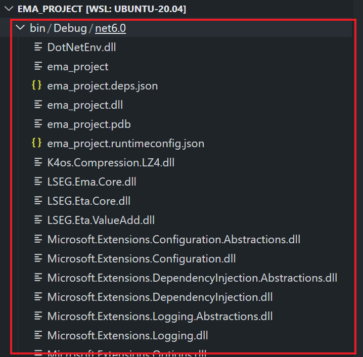

# Step By Step Guide EMA C# project with VS Code 
- version: 1.0.0
- Last Update: January 2024
- Environment: Ubuntu or Windows
- Compiler: .NET 6.0
- Prerequisite: [prerequisite](#prerequisite)

Example Code Disclaimer:
ALL EXAMPLE CODE IS PROVIDED ON AN “AS IS” AND “AS AVAILABLE” BASIS FOR ILLUSTRATIVE PURPOSES ONLY. REFINITIV MAKES NO REPRESENTATIONS OR WARRANTIES OF ANY KIND, EXPRESS OR IMPLIED, AS TO THE OPERATION OF THE EXAMPLE CODE, OR THE INFORMATION, CONTENT, OR MATERIALS USED IN CONNECTION WITH THE EXAMPLE CODE. YOU EXPRESSLY AGREE THAT YOUR USE OF THE EXAMPLE CODE IS AT YOUR SOLE RISK.

## <a id="intro"></a>Introduction

[Real-Time SDK (C# Edition)](https://developers.lseg.com/en/api-catalog/refinitiv-real-time-opnsrc/refinitiv-real-time-csharp-sdk) (RTSDK, formerly known as Elektron SDK) is a suite of modern and open source APIs ([GitHub](https://github.com/Refinitiv/Real-Time-SDK)) that aim to simplify development through a strong focus on ease of use and standardized access to a broad set of Refinitiv proprietary content and services via the proprietary TCP connection named RSSL and proprietary binary message encoding format named OMM Message. The capabilities range from low latency/high-performance APIs right through to simple streaming Web APIs. 

The RTSDK C# Edition can run on Windows, Oracle Linux Server, Red Hat Enterprise Server and Ubuntu Linux platforms. It supports the [Visual Studio 2022 IDE](https://visualstudio.microsoft.com/vs/) for the full features development experience but the IDE is available for Windows developers only. Fortunately, the RTSDK C# Edition also supports the cross-platform [.NET SDK 6](https://learn.microsoft.com/en-us/dotnet/core/whats-new/dotnet-6) (aka .NET Core 6) framework and the [Visual Studio Code](https://code.visualstudio.com/) (aka VS Code) editor is available for all major OS platforms. Linux and Windows developers who are using the VS Code editor can implement the real-time streaming application with LSEG Real-Time platform using the RTSDK C# Edition.

This example project shows a step-by-step guide to create the EMA API .NET project and solution with the RTSDK C# Edition on VS Code and the [C# extension](https://marketplace.visualstudio.com/items?itemName=ms-dotnettools.csharp). I am demonstrating with the RTSDK C# version 2.1.3.L1 on Ubuntu Linux, and this step-by-step guide can be applied to any supported OS platforms.

## <a id="prerequisite"></a>Prerequisite

Before I am going further, there is some prerequisite, dependencies, and libraries that the project is needed.

### .NET SDK

Firstly, you need .NET 6 SDK. You can download the SDK based on your system from [Microsoft .NET 6](https://dotnet.microsoft.com/en-us/download/dotnet/6.0) website.

### Visual Studio Code

Next, the [VS Code](https://code.visualstudio.com/) editor tool with the free [C# extension](https://marketplace.visualstudio.com/items?itemName=ms-dotnettools.csharp).

**Note**: There is also the [C# Dev Kit extension](https://marketplace.visualstudio.com/items?itemName=ms-dotnettools.csdevkit) that gives developers more "Visual Studio like" experience and features than the C# extension. However, the C# Dev Kit extension requires Visual Studio License.

### Access to the RTO

This project uses RTO access credentials for Version 2 Authentication (Service ID).

Please contact your LSEG representative to help you with the RTO account and services.

### Internet Access

The RTSDK C# libraries (both ETA and EMA APIs) are available on the [NuGet](https://www.nuget.org/) package manager and distribution platform. You can use the built-in VS Code CLI command to download the EMA and ETA libraries from NuGet over internet. 

## Create a single project

Let's me start with how to create a single EMA C# .NET project. 

### Initialize A Project

Firstly, create a new folder name ```ema_project``` in your workbench environment.

```bash
$>mkdir ema_project
```

Next, access the ```ema_project``` folder and create a new console project with the following command:

```bash
dotnet new console --framework net6.0 --use-program-main
```
Example result:

```bash
root:/mnt/c$cd ema_project

root:/mnt/c/ema_project$ dotnet new console --framework net6.0 --use-program-main
The template "Console App" was created successfully.

Processing post-creation actions...
Running 'dotnet restore' on /mnt/c/ema_project/ema_project.csproj...
  Determining projects to restore...
  Restored /mnt/c/ema_project/ema_project.csproj (in 77 ms).
Restore succeeded.
```

The ```dotnet new console --framework net6.0 --use-program-main``` command creates a new console project with .NET 6.0 framework for you. The command also create a simple application ```Program.cs``` for as a starting point for the project as follows:


We can test our project creation by running this ```Program.cs``` with the following command:

```bash
root:/mnt/c/ema_project$dotnet run

Hello, World!
```
### Add EMA Library

The RTSDK C# libraries are available on the [NuGet](https://www.nuget.org/) package manager and distribution platform. 


We can add the [EMA Core library](https://www.nuget.org/packages/LSEG.Ema.Core) into the project with the ```dotnet add package LSEG.Ema.Core --version {version}``` command as follows.

```bash
dotnet add package LSEG.Ema.Core --version 3.1.0
```
Result:
```bash
root:/mnt/c/ema_project$ dotnet add package LSEG.Ema.Core --version 3.1.0
  Determining projects to restore...
  Writing /tmp/tmp9S2ovj.tmp
info : X.509 certificate chain validation will use the default trust store selected by .NET.
info : X.509 certificate chain validation will use the default trust store selected by .NET.
info : Adding PackageReference for package 'LSEG.Ema.Core' into project '/mnt/c/ema_project/ema_project.csproj'.info : Restoring packages for C:\ema_project\ema_project.csproj...
info :   GET https://api.nuget.org/v3-flatcontainer/lseg.ema.core/index.json
info :   OK https://api.nuget.org/v3-flatcontainer/lseg.ema.core/index.json 1492ms
info :   GET https://api.nuget.org/v3-flatcontainer/lseg.ema.core/3.1.0/lseg.ema.core.3.1.0.nupkg
info :   OK https://api.nuget.org/v3-flatcontainer/lseg.ema.core/3.1.0/lseg.ema.core.3.1.0.nupkg 829ms
....
info : Package 'LSEG.Ema.Core' is compatible with all the specified frameworks in project '/mnt/c/ema_project/ema_project.csproj'.
info : PackageReference for package 'LSEG.Ema.Core' version '3.1.0' added to file '/mnt/c/ema_project/ema_project.csproj'.
info : Writing assets file to disk. Path:  /mnt/c/ema_project/obj/project.assets.json
log  : Restored C:\ema_project.csproj (in 6.7 sec).

C:\ema_project>
```
You can use ```dotnet list package``` to verify the EMA library package installation.

```bash
root:/mnt/c/ema_project$ dotnet list package
Project 'ema_project' has the following package references
   [net6.0]: 
   Top-level Package      Requested   Resolved
   > LSEG.Ema.Core        3.1.0       3.1.0  

```
Now the ema_project is ready for implementing the real-time application with EMA C# API.

### Add the Real-Time Application Source Code with EMA

The next step is to changing the ```Program.cs``` file source code to call EMA library to connect and consume data from RTO.

To handle ```.env``` file, we add the DotNetEnv library to the project with the following command:

```bash
root:/mnt/c/ema_project$ dotnet add package DotNetEnv --version 3.0.0
```

Then add a ```.env``` file to the ```ema_project``` folder with the following content:

```ini
CLIENT_ID=<Your Auth V Client-ID>
CLIENT_SECRET=<Your Auth V Client-Secret>
```

Now we come to the coding part. You can open the project in VS Code editor by running the ```code .``` command inside the ```ema_project``` folder.


The first step is to adding the ```AppClient``` class to the ```Program.cs``` file. The ```AppClient``` class can be a simple class that print Refresh, Update, and Status messages as follows:

```C#
namespace ema_project;

using LSEG.Ema.Access;
using LSEG.Ema.Domain.Login;
using System;
using System.IO;
using System.Threading;
using DotNetEnv;

internal class AppClient: IOmmConsumerClient
{
    public void OnRefreshMsg(RefreshMsg refreshMsg, IOmmConsumerEvent consumerEvent)
    {
        Console.WriteLine(refreshMsg);
    }
    public void OnUpdateMsg(UpdateMsg updateMsg, IOmmConsumerEvent consumerEvent)
    {
        Console.WriteLine(updateMsg);
    }
    public void OnStatusMsg(StatusMsg statusMsg, IOmmConsumerEvent consumerEvent)
    {
        Console.WriteLine(statusMsg);
    }
    public void OnAllMsg(Msg msg, IOmmConsumerEvent consumerEvent) { }
    public void OnAckMsg(AckMsg ackMsg, IOmmConsumerEvent consumerEvent) { }
    public void onGenericMsg(GenericMsg genericMSg, IOmmConsumerEvent consumerEvent) { }
}

class Program
{
  ...
}
```
Moving on the the ```Program``` class that act as the Consumer:

```C#
internal class AppClient: IOmmConsumerClient
{
  ...
}

class Program
{
    static void Main(string[] args)
    {
        DotNetEnv.Env.Load();
        OmmConsumer? consumer = null;
        try{
            // instantiate callback client
            AppClient appClient = new();
            Console.WriteLine("Connecting to market data server");

            string? clientID = Environment.GetEnvironmentVariable("CLIENT_ID");
            string? clientSecret = Environment.GetEnvironmentVariable("CLIENT_SECRET");
            OmmConsumerConfig config = new OmmConsumerConfig().ClientId(clientID).ClientSecret(clientSecret);
            // create OMM consumer
            consumer = new OmmConsumer(config);

            LoginReq loginReq = new();
            consumer.RegisterClient(loginReq.Message(), appClient);

            Console.WriteLine("Subscribing to market data");

            consumer.RegisterClient(new RequestMsg().ServiceName("ELEKTRON_DD").Name("JPY="), appClient);
            Thread.Sleep(60000); // 

        }catch (OmmException excp){
            Console.WriteLine($"Exception subscribing to market data: {excp.Message}");
        }
        finally
        {
             consumer?.Uninitialize();
        }
    }
}
```
		<Channel>
The final step is to create the ```EmaConfig.xml``` file with the configurations based on this [Enterprise Message API (EMA) - Configuration Overview](https://developers.lseg.com/en/article-catalog/article/elektron-message-api-ema-configuration-overview) article. The main point is set the ```Channel``` to connect to RTO.

```XML
<?xml version="1.0" encoding="UTF-8"?>
<EmaConfig>

<!-- ConsumerGroup provides set of detailed configurations to be used by named consumers				-->
<!-- Application specifies which configuration to use by setting OmmConsumerConfig::consumerName()		-->
<ConsumerGroup>
	<!-- DefaultConsumer parameter defines which consumer configuration is used by OmmConsumer			-->
	<!-- if application does not specify it through OmmConsumerConfig::consumerName()					-->
	<!-- first consumer on the ConsumerList is a DefaultConsumer if this parameter is not specified		-->
	<DefaultConsumer value="Consumer_4"/>
	<ConsumerList>
		<Consumer>
			<Name value="Consumer_4"/>
			<!-- ChannelSet specifies an ordered list of Channels to which OmmConsumer will attempt to	-->
			<!-- connect, one at a time, if the previous one fails to connect							-->
			<ChannelSet value="Channel_4"/>
			<Logger value="Logger_1"/>
			<Dictionary value="Dictionary_1"/>
			<XmlTraceToStdout value="0"/>
		</Consumer>
	</ConsumerList>
</ConsumerGroup>

<ChannelGroup>
	<ChannelList>
		<Channel>
			<Name value="Channel_4"/>
			<ChannelType value="ChannelType::RSSL_ENCRYPTED"/>
			<CompressionType value="CompressionType::None"/>
			<GuaranteedOutputBuffers value="5000"/>
			<!-- EMA discovers a host and a port from RDP service discovery for the specified location 
			    when both of them are not set and the session management is enable. -->
			<Location value="ap-southeast-1"/>
			<EnableSessionManagement value="1"/>
			<EncryptedProtocolType value="EncryptedProtocolType::RSSL_SOCKET"/>
		</Channel>
	</ChannelList>
</ChannelGroup>
...
</EmaConfig>
```

### Build and Run Real-Time Application Source Code

My next point is building and running the application we just created. To build the project, use the [dotnet build](https://learn.microsoft.com/en-us/dotnet/core/tools/dotnet-build) command inside the ```ema_project``` folder.

```bash
dotnet build
```

Or 

```bash
dotnet build --configuration {Debug or Release}
```
Please note that the default configuration value is **Debug**.

Example:

```bash
root:/mnt/c/ema_project$ dotnet build
MSBuild version 17.3.2+561848881 for .NET
  Determining projects to restore...
  All projects are up-to-date for restore.
  ema_project -> /mnt/c/ema_project/bin/Debug/net6.0/ema_project.dll

Build succeeded.
    0 Warning(s)
    0 Error(s)

Time Elapsed 00:00:02.44
```
Then the generated executable ```dll``` (and ```exe``` if you are on Windows) will be available in the *&lt;project folder&gt;/bin/&lt;Debug/Release&gt;/&lt;dotnet target version&gt;* folder as follows:



Please keep in mind that the product of ```dotnet build``` **isn't ready to be transferred to another machine to run**. To create a version of the application that can be deployed, you need to publish it (for example, with the [dotnet publish](https://learn.microsoft.com/en-us/dotnet/core/tools/dotnet-publish) command).

For more detail about the dotnet build command options, please check the [dotnet build document](https://learn.microsoft.com/en-us/dotnet/core/tools/dotnet-build) page.

Next, we come to the [dotnet run](https://learn.microsoft.com/en-us/dotnet/core/tools/dotnet-run) command. This command provides a convenient option to run your application from the source code with one command. 

```bash
dotnet run
```

Please note that the ```dotnet run``` command automatically build the project using ```dotnet build``` if necessary. 

Example:

```bash
root:/mnt/c/ema_project$ dotnet run
Connecting to market data server

INFO|: loggerMsg
    ClientName: ChannelCallbackClient
    Severity: Info    Text:    Received ChannelUp event on channel Channel_4
        Instance Name Consumer_4_1
        Component Version ads3.7.0.E4.linux.rrg 64-bit
loggerMsgEnd
Subscribing to market data
RefreshMsg
    streamId="1"
    domain="Login Domain"
    solicited
    RefreshComplete
    state="Open / Ok / None / 'Login accepted by host ads-fanout-sm-az1-apse1-prd.'"
    ...
    Attrib dataType="ElementList"
        ElementList
            ElementEntry name="AllowSuspectData" dataType="UInt" value="1"
            ElementEntry name="ApplicationId" dataType="Ascii" value="256"
            ElementEntry name="ApplicationName" dataType="Ascii" value="RTO"
            ...
        ElementListEnd
    AttribEnd
    Payload dataType="NoData"
        NoData
        NoDataEnd
    PayloadEnd
RefreshMsgEnd

RefreshMsg
    streamId="5"
    domain="MarketPrice Domain"
    solicited
    ...
    name="JPY="
    nameType="1"
    serviceId="257"
    serviceName="ELEKTRON_DD"
    Payload dataType="FieldList"
        FieldList FieldListNum="99" DictionaryId="1"
            FieldEntry fid="1" name="PROD_PERM" dataType="UInt" value="526"
            FieldEntry fid="2" name="RDNDISPLAY" dataType="UInt" value="153"
            FieldEntry fid="3" name="DSPLY_NAME" dataType="Rmtes" value="BARCLAYS     LON"
            FieldEntry fid="5" name="TIMACT" dataType="Time" value="08:58:00:000:000:000"
            FieldEntry fid="11" name="NETCHNG_1" dataType="Real" value="0.15"
            FieldEntry fid="12" name="HIGH_1" dataType="Real" value="147.88"
            FieldEntry fid="13" name="LOW_1" dataType="Real" value="147.49"
            FieldEntry fid="15" name="CURRENCY" dataType="Enum" value="392"
            FieldEntry fid="17" name="ACTIV_DATE" dataType="Date" value="26 JAN 2024 "
            FieldEntry fid="19" name="OPEN_PRC" dataType="Real" value="147.61"
            FieldEntry fid="21" name="HST_CLOSE" dataType="Real" value="147.65"
            FieldEntry fid="22" name="BID" dataType="Real" value="147.8"
            FieldEntry fid="23" name="BID_1" dataType="Real" value="147.81"
            FieldEntry fid="24" name="BID_2" dataType="Real" value="147.79"
            FieldEntry fid="25" name="ASK" dataType="Real" value="147.83"
            ...
            FieldEntry fid="14208" name="BID_HR_MS" dataType="Time" value="08:00:00:289:000:000"
        FieldListEnd
    PayloadEnd
RefreshMsgEnd

UpdateMsg
    streamId="5"
    domain="MarketPrice Domain"
    updateTypeNum="0"
    name="JPY="
    serviceId="257"
    serviceName="ELEKTRON_DD"
    Payload dataType="FieldList"
        FieldList
            FieldEntry fid="22" name="BID" dataType="Real" value="147.81"
            FieldEntry fid="393" name="PRIMACT_1" dataType="Real" value="147.81"
            FieldEntry fid="25" name="ASK" dataType="Real" value="147.82"
        FieldListEnd
    PayloadEnd
UpdateMsgEnd
...
```

The ```dotnet run``` command is used in the context of projects, not built assemblies. If you're trying to run a framework-dependent application DLL instead, you must use dotnet without a command inside *&lt;project folder&gt;/bin/&lt;Debug/Release&gt;/&lt;dotnet target version&gt;* folder like the following example:

```bash
C:\ema_project\bin\Debug\net6.0> dotnet ema_project.dll
```

Please note that when running a framework-dependent application DLL above, you need to copy all necessary files (like the EmaConfig.xml or .env file) to the *&lt;project folder&gt;/bin/&lt;Debug/Release&gt;/&lt;dotnet target version&gt;* folder as well.

For more detail about the run options, please check the [dotnet run document](https://learn.microsoft.com/en-us/dotnet/core/tools/dotnet-run) page.

### Publishing the Project

The ```dotnet publish ``` compiles the application, reads through its dependencies specified in the project file, and publishes the resulting set of files to a directory (containing dll, configuration json files, dependencies files, etc). The command output is ready for deployment to a hosting system for execution.  You can publish the .NET application in 2 modes as follows:
- *self-contained* mode: This mode produces an application that includes the .NET runtime and libraries, and your application and its dependencies. Users of the application can run it on a machine that doesn't have the .NET runtime installed.
- *framework-dependent*: This mode produces an application that includes only your application itself and its dependencies. Users of the application have to separately install the .NET runtime.

Please note that both publishing modes produce a platform-specific executable by default. Framework-dependent applications can be created without an executable, and these applications are cross-platform.

Example: creates a framework-dependent executable for the current platform.

```bash
# On Windows

C:\ema_project>dotnet publish
MSBuild version 17.5.0-preview-23061-01+040e2a90e for .NET
  Determining projects to restore...
  Restored C:\ema_project\ema_project.csproj (in 1.82 sec).
  ema_project -> C:\ema_project\bin\Debug\net6.0\ema_project.dll    
  ema_project -> C:\ema_project\bin\Debug\net6.0\publish\

C:\ema_project>
```
Result:


Example: creates a self-contained executable for the Windows platform.

```bash
# On Linux

root:/mnt/c/ema_project$ dotnet publish --configuration Release --runtime win-x64 --self-contained
MSBuild version 17.3.2+561848881 for .NET
  Determining projects to restore...
  Restored /mnt/c/ema_project/ema_project.csproj (in 648 ms).
  ema_project -> /mnt/c/ema_project/bin/Release/net6.0/win-x64/ema_project.dll
  ema_project -> /mnt/c/ema_project/bin/Release/net6.0/win-x64/publish/
```
Result:


Then you can copy a result directory with all dependencies files to deploy and run on your target machine using the ema_project binary file (based on your runtime).

To learn more about the publish and deployment options, please check the following resources:
* [dotnet publish](https://learn.microsoft.com/en-us/dotnet/core/tools/dotnet-publish) document.
* [.NET runtime identifier catalog](https://learn.microsoft.com/en-us/dotnet/core/rid-catalog) document.
* [.NET application publishing overview](https://learn.microsoft.com/en-us/dotnet/core/deploying/) documents.

That all I have to say about creating the EMA .NET Project using VS Code.

## Create the EMA API Real-Time Application Solution

My next point is creating a solution. When you are doing a software development project, your application may needs multiple source code projects for easy management and implementation by multiple developers.  A Visual Studio solution is a container to organize one or more related projects.  When you open a solution, Visual Studio and Visual Studio Code automatically loads all the projects that the solution contains.

### Initialize A Solution

Firstly, create a new folder name ```ema_solution``` in your workbench environment.

```bash
$>mkdir ema_solution
```

Next, access the ```ema_solution``` and create a new console project with the following command:

```bash
dotnet new sln
```
Example result:

```bash
root:/mnt/c$cd ema_solution

root:/mnt/c/ema_solution$ dotnet new sln
The template "Solution File" was created successfully.
```
Our EMA Solution has 2 projects as follows:
- A *JSONUtil* class library project that contains a POCO object for storing RIC data and transform the RIC data into a JSON message format
- A EMA C# console project that connects and consume data from RTO, and print the market price data in JSON message format using a JSONUtil class library above.

### Initialize A Class Library Project

Let's start with a class library project. Firstly, create a new project inside ```ema_solution``` folder with the following dotnet CLI command.

```bash
dotnet new classlib -f net6.0 -o JSONUtil
```
Result:
```bash
root:/mnt/c/ema_solution$ dotnet new classlib -f net6.0 -o JSONUtil
The template "Class Library" was created successfully.

Processing post-creation actions...
Running 'dotnet restore' on /mnt/c/ema_solution/JSONUtil/JSONUtil.csproj...
  Determining projects to restore...
  Restored /mnt/c/ema_solution/JSONUtil/JSONUtil.csproj (in 67 ms).
Restore succeeded.
```
Next, add this JSONUtil project to solution with the following command

```bash
dotnet sln add JSONUtil/JSONUtil.csproj
```
Result:
```bash
Project `JSONUtil/JSONUtil.csproj` added to the solution.
```

This JSONUtil project uses [Newtonsoft.Json](https://www.nuget.org/packages/Newtonsoft.Json) package from the [NuGet](https://www.nuget.org/) platform for serialize/deserialize JSON data, so we add this package from NuGet to the project via the following command.

```bash
root:/mnt/c/ema_solution/JSONUtil$ dotnet add package Newtonsoft.Json --version 13.0.3
```
### Add the Class Library Source Code

Once the package install succeed, open a solution with VS Code with the ```code .``` command in a ```ema_solution``` folder. The VS Code editor will be opened the EMA_SOLUTION solution like shown in the following image.


Open a ```Class.cs``` file and add the following POCO code to the file.


```C#
namespace JSONUtil;

using Newtonsoft.Json;

public class RIC{
   
    public string Name {get; set;} = string.Empty;
    public string ServiceName {get; set;} = string.Empty;
    public double BID {get; set;}
    public double ASK {get; set;}
    public double NETCHNG_1 {get; set;}

    public RIC() {}

    public RIC(string ric, string serviceName, double bid = 0D, double ask = 0D, double netChange = 0D)
    {
        this.Name = ric;
        this.ServiceName = serviceName;
        this.BID = bid;
        this.ASK = ask;
        this.NETCHNG_1 = netChange;
    }
    public string ToJSON()
    {
        return JsonConvert.SerializeObject(this);
    }
}
```

This POCO code just store RIC information such as ```Name```, ```ServiceName```, and Market Data information ```BID```, ```ASK```, and ```NETCHNG_1``` fields data. It also contains a ```ToJSON()``` method that serialize self data from RIC object to JSON string message and sends that JSON string to a caller.

You can build entire solution by running ```dotnet build``` command inside a ```ema_solution``` folder or build just  a ```JSONUtil``` project with a ```dotnet build``` command inside a ```ema_solution\JSONUtil``` folder.

Example (build entire solution):

```bash
root:/mnt/c/ema_solution$ dotnet build
MSBuild version 17.3.2+561848881 for .NET
  Determining projects to restore...
  All projects are up-to-date for restore.
  JSONUtil -> /mnt/c/ema_solution/JSONUtil/bin/Debug/net6.0/JSONUtil.dll

Build succeeded.
    0 Warning(s)
    0 Error(s)

Time Elapsed 00:00:02.42
```
### Initialize A EMA API Project

The next step is adding the EMAConsumer project. Please go back to the ```ema_solution``` folder and add new EMA console application project with the following command:

```bash
dotnet new console --framework net6.0 -o EMAConsumer --use-program-main
```
Next, add this EMAConsumer project to solution with the following command

```bash
dotnet sln add EMAConsumer/EMAConsumer.csproj
```

The newly created EMAConsumer project does not have access to the JSONUtil class library project, so we need to add a project reference to the JSONUtil project with the following command.

```bash
dotnet add EMAConsumer/EMAConsumer.csproj reference JSONUtil/JSONUtil.csproj
```
Example:

```bash
root:/mnt/c/ema_solution$ dotnet add EMAConsumer/EMAConsumer.csproj reference JSONUtil/JSONUtil.csproj
Reference `..\JSONUtil\JSONUtil.csproj` added to the project.
root:/mnt/c/ema_solution$ 
```

Now we are ready to add the [EMA](https://www.nuget.org/packages/LSEG.Ema.Core) and [DotNetEnv](https://www.nuget.org/packages/DotNetEnv) packages into the EMAConsumer project. Please go to the ```ema_solution\EMAConsumer```  and run the following command.

```bash
dotnet add package LSEG.Ema.Core --version 3.1.0

dotnet add package DotNetEnv --version 3.0.0
```

Once the EMAConsumer project is finished setup, the VS Code workspace contains both projects that you can develop in the same editor.


### Add the Real-Time Application Source Code with EMA

The next step is to changing the ```Program.cs``` file source code to call EMA API interfaces and JSONUtil library to consume data from RTO and print that data as JSON message format.

Firstly, add a ```.env``` file to the ```ema_solution/EMAConsumer``` folder with the following content:

```ini
CLIENT_ID=<Your Auth V Client-ID>
CLIENT_SECRET=<Your Auth V Client-Secret>
```

Secondly, open the ```EMAConsumer/Program.cs``` file and add the following library import to the file header.


```C#
namespace EMAConsumer;
using JSONUtil;
using System;
using System.IO;
using System.Threading;
using LSEG.Ema.Access;
using LSEG.Ema.Domain.Login;
using static LSEG.Ema.Access.DataType;
using LSEG.Ema.Rdm;
using DotNetEnv;

class Program
{
    ...
}
```

Next, modify the ```main()``` function to call the EMA API interfaces as follows:

```C#
class Program
{
    static void Main(string[] args)
    {

        string RicName = "THB=";
        string ServiceName = "ELEKTRON_DD";
        RIC ric = new RIC(RicName,ServiceName);

        DotNetEnv.Env.Load();
        OmmConsumer? consumer = null;
        try{
            // instantiate callback client
            AppClient appClient = new();
            appClient.SetRicObj(ric);
            Console.WriteLine("Connecting to market data server");

            string clientID = Environment.GetEnvironmentVariable("CLIENT_ID") ?? "<Client_ID>";
            string clientSecret = Environment.GetEnvironmentVariable("CLIENT_SECRET") ?? "<Client_Secret>";
            OmmConsumerConfig config = new OmmConsumerConfig().ClientId(clientID).ClientSecret(clientSecret);
            // create OMM consumer
            consumer = new OmmConsumer(config);

            Console.WriteLine("Subscribing to market data");

            LoginReq loginReq = new();
			consumer.RegisterClient(loginReq.Message(), appClient);

            OmmArray array = new()
            {
                FixedWidth = 2
            };

            array.AddInt(11) //NETCHNG_1
                .AddInt(22) //BID
				.AddInt(25) //ASK
				.Complete();
            
            var view = new ElementList()
				.AddUInt(EmaRdm.ENAME_VIEW_TYPE, 1)
				.AddArray(EmaRdm.ENAME_VIEW_DATA, array)
				.Complete();
            
            RequestMsg reqMsg = new();

            consumer.RegisterClient(reqMsg.ServiceName(ServiceName).Name(RicName).Payload(view), appClient);
            Thread.Sleep(60000); // 

        }catch (OmmException excp){
            Console.WriteLine($"Exception subscribing to market data: {excp.Message}");
        }
        finally
        {
             consumer?.Uninitialize();
        }
    }
}
```

The code above perform the following tasks:
1. Create JSONUtil's ```RIC``` object.
2. Create ```AppClient``` object and pass a ```RIC``` object to ```AppClient``` for storing data from the API.
3. Create a ```OmmConsumerConfig``` with the RTO Authentication Version 2 credential.
4. Register the Login stream.
5. Create a View request message that subscribes for *NETCHNG_1*, *BID*, and *ASK* fields, then subscribes item.

์Now we come to the ```AppClient``` class path that needs to get a ```RIC``` object from the main class, update ```RIC``` object data with incoming data via the ```OnRefreshMsg``` and ```OnUpdateMsg``` callback methods and call ```RIC.ToJSON()``` method to print out incoming data as a JSON message.

```C#
namespace EMAConsumer;

using JSONUtil;
....

internal class AppClient: IOmmConsumerClient
{
    RIC _ric;
    private readonly LoginRefresh _loginRefresh = new();
    private readonly LoginStatus _loginStatus = new();

    public void SetRicObj(RIC ric)
    {
        this._ric = ric;
    }
    public void OnRefreshMsg(RefreshMsg refreshMsg, IOmmConsumerEvent consumerEvent)
    {

        Console.WriteLine("Refresh Message");
        if(refreshMsg.DomainType() == EmaRdm.MMT_LOGIN)
        {
            _loginRefresh.Clear();
            Console.WriteLine(_loginRefresh.Message(refreshMsg).ToString());
        } else
        {
            if (DataType.DataTypes.FIELD_LIST == refreshMsg.Payload().DataType)
			    Decode(refreshMsg.Payload().FieldList());

            Console.WriteLine(_ric.ToJSON());
        }

		Console.WriteLine();
    }
    public void OnUpdateMsg(UpdateMsg updateMsg, IOmmConsumerEvent consumerEvent)
    {
        Console.WriteLine("Update Message");
		if (DataTypes.FIELD_LIST == updateMsg.Payload().DataType)
			Decode(updateMsg.Payload().FieldList());
		
        Console.WriteLine(_ric.ToJSON());
		Console.WriteLine();
    }
    public void OnStatusMsg(StatusMsg statusMsg, IOmmConsumerEvent consumerEvent)
    {
    ...
    }
}

```
Moving on the the ```Decode``` method that iterates incoming FieldList message and updates a ```RIC``` object's *NETCHNG_1*, *BID*, and *ASK* properties.  

```C#
internal class AppClient: IOmmConsumerClient
{
    ...
    void Decode(FieldList fieldList)
    {
        foreach (var fieldEntry in fieldList)
        {
            var FieldName = fieldEntry.Name;
            _ric.GetType().GetProperty(FieldName).SetValue(_ric, Decode(fieldEntry));
        }
    }

    double Decode(FieldEntry fieldEntry)
    {
        double ReturnValue = 0D;
        if (Data.DataCode.BLANK == fieldEntry.Code)
        {
            return ReturnValue;
        }
        else
        {
            switch (fieldEntry.LoadType)
            {
                case DataTypes.REAL:
                    ReturnValue = fieldEntry.OmmRealValue().AsDouble();
                    break;
                default:
                    ReturnValue = 0D;
                    break;
            }
        }
        return ReturnValue;
    }
}
```
The final step is to create the ```EmaConfig.xml``` file with the configurations like the ```ema_project``` above to configure the API to connect to RTO endpoint.

### Build and Run Real-Time Application Solution

You can build entire solution by running the ```dotnet build``` command in the ```ema_solution``` folder or build only this EMAConsumer project by running the ```dotnet build``` command in the  ```ema_solution\EMAConsumer``` folder.

Example: Build entire solution

```bash
root:/mnt/c/ema_solution$ dotnet build
MSBuild version 17.3.2+561848881 for .NET
  Determining projects to restore...
  All projects are up-to-date for restore.
  JSONUtil -> /mnt/c/ema_solution/JSONUtil/bin/Debug/net6.0/JSONUtil.dll
  EMAConsumer -> /mnt/c/ema_solution/EMAConsumer/bin/Debug/net6.0/EMAConsumer.dll

Build succeeded.
    0 Warning(s)
    0 Error(s)

Time Elapsed 00:00:03.17
```

Unlike the Visual Studio IDE that you can set a solution default project and click the "Run" button on the IDE. With VS Code (and .NET CLI), you need to run the project in side a project folder using the ```dotnet run``` command or with ```dotnet run --project &lt;project/project.csproj&gt;``` (All required runtime file must be located on the solution home folder).

Run Result: Run inside the EMAConsumer project folder.

```bash
root:/mnt/c/ema_solution$ cd EMAConsumer/
root:/mnt/c/ema_solution/EMAConsumer$ dotnet run
Connecting to market data server

INFO|: loggerMsg
    ClientName: ChannelCallbackClient
    Severity: Info    Text:    Received ChannelUp event on channel Channel_4
        Instance Name Consumer_4_1
        Component Version ads3.7.0.E4.linux.rrg 64-bit
loggerMsgEnd
Subscribing to market data
Refresh Message

AllowSuspectData : True
ApplicationId : 256
ApplicationName : RTO
...
UserNameType : 1
State : StreamState: 1 DataState: 1 StatusCode: 0 StatusText: Login accepted by host ads-fanout-sm-az2-apse1-prd.

Refresh Message
{"NETCHNG_1":-0.08,"BID":149.22,"ASK":149.24,"Name":"JPY=","ServiceName":"ELEKTRON_DD"}

Update Message
{"NETCHNG_1":-0.08,"BID":149.22,"ASK":149.23,"Name":"JPY=","ServiceName":"ELEKTRON_DD"}

Update Message
{"NETCHNG_1":-0.09,"BID":149.21,"ASK":149.24,"Name":"JPY=","ServiceName":"ELEKTRON_DD"}

Update Message
{"NETCHNG_1":-0.08,"BID":149.22,"ASK":149.23,"Name":"JPY=","ServiceName":"ELEKTRON_DD"}

Update Message
{"NETCHNG_1":-0.09,"BID":149.21,"ASK":149.24,"Name":"JPY=","ServiceName":"ELEKTRON_DD"}
...
```

### Publishing the Solution

You can publish the solution using the ```dotnet publish``` like the project by specify the the path and filename of a solution file (.sln extension) after the command. 

Example:
```bash
dotnet publish ./ema_solution.sln 
```

All [dotnet publish](https://learn.microsoft.com/en-us/dotnet/core/tools/dotnet-publish) command arguments are supported in the solution level too.

Example: creates a self-contained executable for the Windows platform.

```bash
root:/mnt/c/ema_solution$ dotnet publish ./ema_solution.sln --configuration Release --runtime win-x64 --self-contained
MSBuild version 17.3.2+561848881 for .NET
  Determining projects to restore...
  Restored /mnt/c/ema_solution/JSONUtil/JSONUtil.csproj (in 361 ms).
  Restored /mnt/c/ema_solution/EMAConsumer/EMAConsumer.csproj (in 731 ms).
  JSONUtil -> /mnt/c/ema_solution/JSONUtil/bin/Release/net6.0/JSONUtil.dll
  JSONUtil -> /mnt/c/ema_solution/JSONUtil/bin/Release/net6.0/win-x64/JSONUtil.dll
  ...
  EMAConsumer -> /mnt/c/ema_solution/EMAConsumer/bin/Release/net6.0/win-x64/EMAConsumer.dll
  JSONUtil -> /mnt/c/ema_solution/JSONUtil/bin/Release/net6.0/win-x64/publish/
  EMAConsumer -> /mnt/c/ema_solution/EMAConsumer/bin/Release/net6.0/win-x64/publish/
```

The publish result will be available inside each Project' */bin/&lt;Debug/Release&gt;/&lt;dotnet target version&gt;* folder like the following example of the Class Library project. 


About the EMAConsumer, the publish result also contains the JSONUtil class library's dll file because we have added a project reference to the JSONUtil project.


That covers the EMA Solution project with VS Code.

<!--
## Docker
1. docker build . -t dotnetema
2. docker run -it --name dotnetema dotnetema
-->

# Links
1. https://learn.microsoft.com/en-us/dotnet/core/tutorials/library-with-visual-studio-code?pivots=dotnet-6-0
2. https://learn.microsoft.com/en-us/dotnet/core/docker/build-container?tabs=windows&pivots=dotnet-7-0
3. https://hub.docker.com/_/microsoft-dotnet-sdk/
4. https://hub.docker.com/_/microsoft-dotnet-runtime/
5. https://www.nuget.org/packages/LSEG.Ema.Core 
6. https://github.com/tonerdo/dotnet-env
7. https://code.visualstudio.com/docs/csharp/project-management